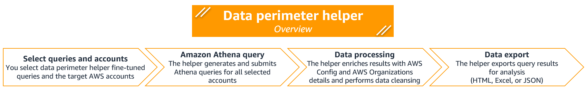
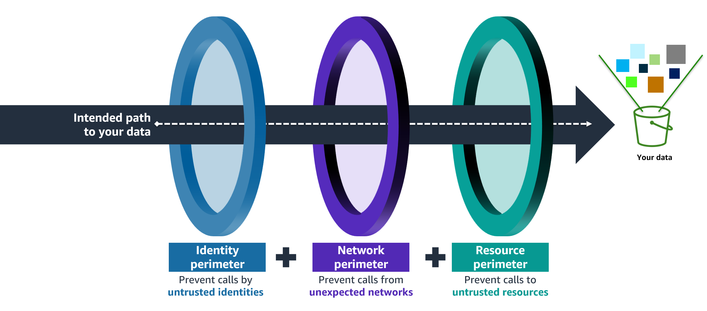

# Data perimeter helper

Copyright Amazon.com, Inc. or its affiliates. All Rights Reserved.
SPDX-License-Identifier: MIT-0

## Table of Contents

0. [DISCLAIMER](#disclaimer)
1. [Data perimeter helper – Overview](#1-data-perimeter-helper---overview)
2. [Getting started](#2-getting-started)
3. [How to use data perimeter helper](#3-how-to-use-data-perimeter-helper)
4. [Data perimeter helper queries](#4-data-perimeter-helper-queries)
5. [Data perimeter helper – Example use cases](#5-data-perimeter-helper---examples-use-cases)
6. [Data perimeter helper documentation](#6-data-perimeter-helper-documentation)
7. [Definitions](#7-definitions)
8. [Project structure](#8-project-structure)
9. [Uninstallation](#9-uninstallation)
10. [Resources](#10-resources)

## DISCLAIMER

The sample code; software libraries; command line tools; proofs of concept; templates; or other related technology (including any of the foregoing that are provided by our personnel) is provided to you as AWS Content under the AWS Customer Agreement, or the relevant written agreement between you and AWS (whichever applies). You should not use this AWS Content in your production accounts, or on production or other critical data. You are responsible for testing, securing, and optimizing the AWS Content, such as sample code, as appropriate for production grade use based on your specific quality control practices and standards.

# 1. Data perimeter helper – Overview

AWS offers a set of features and capabilities you can use to implement a data perimeter to help prevent data disclosure and unintended access to your data. A data perimeter is a set of preventive controls you use to help ensure that only your **trusted identities** are accessing **trusted resources** from **expected networks**.

If you are new to data perimeter concepts, see [Data perimeters on AWS]( https://aws.amazon.com/identity/data-perimeters-on-aws/).

`Data perimeter helper` is a tool that helps you design and anticipate the impact of your data perimeter controls by analyzing access activity in your [AWS CloudTrail](https://docs.aws.amazon.com/awscloudtrail/latest/userguide/cloudtrail-user-guide.html) logs.

`Data perimeter helper` provides a set of queries tailored for specific data perimeter objectives. For example, you can use the `data perimeter helper` query [`common_from_public_cidr_ipv4`](./data_perimeter_helper/queries/common/common_from_public_cidr_ipv4.py) to review API calls that are made from public IPv4 addresses and facilitate your [network perimeter]( https://aws.amazon.com/fr/blogs/security/establishing-a-data-perimeter-on-aws-allow-access-to-company-data-only-from-expected-networks/) implementation.

Based on your business and security requirements, you define your data perimeters by setting what trusted identities, trusted resources and expected networks mean for your organization. You can document your data perimeter definition in the `data perimeter helper` [configuration file](./data_perimeter_helper/data_perimeter.yaml) to fine-tune `data perimeter helper` results.

`Data perimeter helper` uses tailored [Amazon Athena](https://docs.aws.amazon.com/athena/latest/ug/what-is.html) queries to analyze your CloudTrail logs. It then performs data processing to enrich query results with your resource configuration information retrieved from [AWS Config](https://docs.aws.amazon.com/config/latest/developerguide/WhatIsConfig.html) and [AWS Organizations](https://docs.aws.amazon.com/organizations/latest/userguide/orgs_introduction.html) and to remove irrelevant information. And finally, it returns the API calls that do not adhere to your data perimeter definition, helping you to:
1.	Build and fine-tune your data perimeter policies.
2.	Assess potential impact on your workloads before deployment.
3.	Support troubleshooting activities after deployment.




The following is an example of `data perimeter helper` usage:

One of the security objectives pursued by companies is ensuring that their [Amazon S3](https://docs.aws.amazon.com/AmazonS3/latest/userguide/Welcome.html) buckets can be accessed only by AWS Identity and Access Management (IAM) principals belonging to their AWS organization. You can help achieve this security objective by implementing an [identity perimeter](https://aws.amazon.com/blogs/security/establishing-a-data-perimeter-on-aws-allow-only-trusted-identities-to-access-company-data/) on your buckets.


Before enforcing identity perimeter controls, you can run the `data perimeter helper` query [`s3_bucket_policy_identity_perimeter_org_boundary`](./data_perimeter_helper/queries/s3/s3_bucket_policy_identity_perimeter_org_boundary.py) to identify principals that do not belong to your AWS organization *and* have performed API calls to your Amazon S3 buckets in a given time frame.

In this example, `data perimeter helper` performs the following actions:
1.	Analyzes CloudTrail events to identify principals that have performed Amazon S3 API calls in a given time frame.
2.	Removes API calls performed by principals belonging to your AWS organization and those documented as trusted in the `data perimeter helper` [configuration file](./data_perimeter_helper/data_perimeter.yaml).
3.	Enriches results to ease analysis. For example, `data perimeter helper` adds a field `isAssumableBy` with the list of principals in IAM roles’ trust policies.
4.	Exports the results to a file for analysis (HTML, Excel, or JSON).


You can then review `data perimeter helper` results to identify principals not belonging to your AWS organization that performed API calls on your S3 buckets. If you determine that the principals have a legitimate reason to access your buckets, you can update your identity perimeter controls and document the principals as trusted in the `data perimeter helper` configuration file. Otherwise, you can investigate with your development teams to understand why the principals performed those API calls and proceed according to your policy.

Note that `data perimeter helper` is intended to accelerate your analysis — not to replace human analysis. The helper relies on CloudTrail logs to help you reason about potential impacts of policies you write. Though CloudTrail provides you information about parameters of a request, it does not reflect values of IAM condition keys present in the request.


## Demo with an animated GIF


# 2. Getting started
## 2.1 Prerequisites

### 2.1.1 Prerequisites - Python 
`Data perimeter helper` is built on Python. To run it, you need the following to be installed on your system:
1.	[Python 3](https://www.python.org/downloads/) (tested with 3.11.4).
2.	pip (tested with 23.2.1).
3.	virtualenv (tested with 20.24.6). You can install virtualenv by using the following command:
  ```shell
  $ python -m pip install virtualenv
  ```


### 2.1.2 Prerequisites – AWS environment

`Data perimeter helper` uses AWS services and features. Be sure to configure the following in your AWS environment:
1.	AWS Organizations.
2.	A [CloudTrail organization trail](https://docs.aws.amazon.com/awscloudtrail/latest/userguide/creating-trail-organization.html) with management events enabled and sent to a central Amazon S3 bucket. If you use AWS services that support [CloudTrail data events](https://docs.aws.amazon.com/awscloudtrail/latest/userguide/logging-data-events-with-cloudtrail.html) and want to analyze the associated API calls, enable the relevant data events.
3.	An Athena table to perform queries on CloudTrail logs stored in the previously mentioned Amazon S3 bucket:

Data perimeter helper queries expect a specific table schema. You can use the following query to create a table that meets the requirement: [./prerequisites/athena/organization_trail_athena_table.sql](./prerequisites/athena/organization_trail_athena_table.sql?ref_type=heads).

`Data perimeter helper` supports a setup where management events are stored in one bucket and data events in another.

4.	AWS Config organization aggregator.

To accelerate the deployment of the preceding prerequisites, you can use the following Terraform templates: [./prerequisites/terraform/README.md](./prerequisites/terraform?ref_type=heads).

5. (Optional) [AWS IAM Access Analyzer](https://docs.aws.amazon.com/IAM/latest/UserGuide/what-is-access-analyzer.html) [external access analyzer](https://docs.aws.amazon.com/IAM/latest/UserGuide/access-analyzer-concepts.html).

You can configure `data perimeter helper` to retrieve IAM Access Analyzer external access findings from AWS IAM Access Analyzer or [AWS Security Hub](https://docs.aws.amazon.com/securityhub/latest/userguide/what-is-securityhub.html).
Security Hub provides provides [cross-region aggregation](https://docs.aws.amazon.com/securityhub/latest/userguide/finding-aggregation.html) enabling you to retrieve more easily findings accross your organization.
If you choose Security Hub then you need to have Security Hub cross-region enabled for your organization.

### 2.1.3 Prerequisites – AWS IAM permissions

`Data perimeter helper` uses three IAM principals to perform its operations:
1.	A principal with permissions to run Athena queries, read CloudTrail logs, and read/write Athena query results.
2.	A principal with AWS Config permissions to run AWS Config advanced queries.
3.	A principal with permissions to list AWS accounts in AWS Organizations.
4.  (Optional) A principal with permissiosn to get IAM Access Analyzer external access findings.

The following diagram demonstrates how these permissions are utilized by the tool:


Optionally, you can use a single IAM principal with all required permissions granted in its permissions policy. 
For sample IAM policies, see: [./prerequisites/dph/dph_principals.md](./prerequisites/dph/dph_principals.md).


## 2.2 Installation

To install `data perimeter helper`, follow these steps:
1.	At the root level of the project, create a Python virtual environment by using the following command:
  ```shell
  $ python -m venv .venv
  ```
2.	Activate the virtual environment by using the following command:
  ```shell
  $ source .venv/bin/activate (on Unix)
  % .venv/Scripts/activate.ps1 (on Windows)
  ```
3.	Make sure that the latest pip version is used by using the following command:
  ```shell
  $ python -m pip install --upgrade pip
  ```
4.	Install the `data perimeter helper` package by using the following command:
  ```shell
  $ pip install -e ./
  ```
5.	Test if the `data_perimeter_helper` package has been correctly installed by using the following command:
  ```shell
  $ data_perimeter_helper --version
  ```
The command line will display the current version of the helper:
  ```shell
  Data perimeter helper - vX.Y.Z
  ```


## 2.3 Configuration parameters

With the `data perimeter helper` installed, the next step is to provide your configuration parameters:
  1.	Update [variables.yaml](./data_perimeter_helper/variables.yaml) by specifying the names of AWS CLI credential profiles, the name of your Athena table, and others parameters specific to your environment.
    
  For an example, see [./prerequisites/dph/variable.sample.yaml](./prerequisites/dph/variable.sample.yaml).

  2.	Update `data perimeter helper` configuration file [data_perimeter.yaml](./data_perimeter_helper/data_perimeter.yaml) with your data perimeter definition by entering your trusted identities, expected networks, and trusted resources.

  For an example, see [./prerequisites/dph/data_perimeter_sample.yaml](./prerequisites/dph/data_perimeter_sample.yaml).


# 3. How to use data perimeter helper

## 3.1 Common commands for data perimeter helper

The following list provides common `data perimeter helper` commands:
1.	Get help:
  ```shell
  $ data_perimeter_helper/dph -h
  ```
2.	Run a specific query on one account:
  ```shell
  $ dph --list-account/-la <ACCOUNT_ID> --list-query/-lq <QUERY_NAME>
  ```

You can use `--list-account/-la` with an account ID.

3.	Run a specific query on multiple accounts.

You can use `--list-account/-la` with multiple account IDs or account names:
  ```shell
  $ dph --list-account/-la <ACCOUNT_ID_1> <ACCOUNT_ID_2> -lq <QUERY_NAME>
  ```

If your account name contains spaces but the name under quotes.

You can run your query across all your organization by setting `--list-account/-la` to `all`:
  ```shell
  $ dph --list-account/-la all -lq <QUERY_NAME>
  ```

If you want to run your query against accounts descendant of specific organizational units, you can use `--list-ou/-lo` with multiple organizational unit IDs:
  ```shell
  $ dph --list-ou/-lo <OU_ID_1> <OU_ID_2> -lq <QUERY_NAME>
  ```


4.	Run a specific query on one account using the substring of a query name:
  ```shell
  $ dph -la <ACCOUNT_ID> -lq <SUBSTRING_OF_QUERY_NAME>
  ```
For example, by using `bucket` as a substring, any query name containing `bucket` would be selected.


5.	Run multiple queries on multiple accounts:
  ```shell
  $ dph -la <ACCOUNT_ID_1> <ACCOUNT_ID_2> -lq <QUERY_NAME_1> <QUERY_NAME_2>
  ```

6.	Use a custom variables file:

By default, variables' values are retrieved from the [variables.yaml](./data_perimeter_helper/variables.yaml) file.    
This behavior can be overridden with the `--variable_file/-vf` flag. You can use this flag if you have multiple configuration profiles.
  ```shell
  $ dph -la <ACCOUNT_ID> -lq <QUERY_NAME> --variable-file/-vf my_custom_variable_file.yaml
  ```

7.	Specify the export file format:

Supported formats: HTML, Excel, and JSON.   
By default, if the `--export-format/-ef` flag is not set, HTML and Excel formats are used.

```shell
$ dph --export-format/-ef html excel json
```

# 4. Data perimeter helper queries
## 4.1 Available queries
### 4.1.1 Common queries

You can use `common` queries to analyze activity in your AWS organization against data perimeter objectives without focusing on a specific AWS service. Example: review all API calls from public IPv4 addresses.    

The `common` queries are prefixed with the keyword `common` and are *not* tied to a specific AWS service. For more information, see: [./data_perimeter_helper/queries/common/README.md](./data_perimeter_helper/queries/common/README.md).


### 4.1.2 Referential queries

You can use `referential` queries to get insights on your resource configurations.    
The `referential` queries rely on AWS Config advanced queries and AWS Organizations API calls.

The `referential` queries are prefixed with the keyword `referential` and are *not* tied to a specific AWS service. For more information, see: [./data_perimeter_helper/queries/common/README.md](./data_perimeter_helper/queries/referential/README.md).


### 4.1.3 Findings queries

You can use `findings` queries to get insights on your AWS IAM Access Analyzer external access findings.    
The `findings` queries rely on AWS IAM Access Analyzer or AWS Security Hub API calls depending on the value of variable `external_access_findings` in the [variables file](./data_perimeter_helper/variables.yaml).

The `findings` queries are prefixed with the keyword `findings` and are *not* tied to a specific AWS service. For more information, see: [./data_perimeter_helper/queries/findings/README.md](./data_perimeter_helper/queries/findings/README.md).


### 4.1.4 Amazon S3 queries

You can use `s3` queries to analyze activity in your AWS organization against data perimeter objectives while focusing exclusively on [Amazon S3](https://docs.aws.amazon.com/AmazonS3/latest/userguide/Welcome.html) API calls.    

The `s3` queries are prefixed with the keyword `s3`. For more information, see: [./data_perimeter_helper/queries/s3/README.md](./data_perimeter_helper/queries/s3/README.md).


### 4.1.5 Amazon SNS queries

You can use `sns` queries to analyze activity in your AWS organization against data perimeter objectives while focusing exclusively on  [Amazon SNS](https://docs.aws.amazon.com/sns/latest/dg/welcome.html) API calls.    

The `sns` queries are prefixed with the keyword `sns`. For more information, see: [./data_perimeter_helper/queries/sns/README.md](./data_perimeter_helper/queries/sns/README.md).


## 4.2 How to add new queries

You can add your custom queries to the tool by using a query template file: [./data_perimeter_helper/queries/template.py](./data_perimeter_helper/queries/template.py). 

Follow these steps to add a new query:
1.	Copy and paste the query template file in a direct child folder of [./data_perimeter_helper/queries/](./data_perimeter_helper/queries/) (such as `common` or `s3`). You can create new subfolders, if necessary.   
Rename the file and the Python class name `query_name_replace_me` inside it with your query name.

2. The file and class names must match (for example, file name: `sns_identity_perimeter.py`, class name: `sns_identity_perimeter`). Also, the file and class names must be prefixed with the folder name (for example, folder name: `s3`, file name: `s3_my_query_name`).  
Configure your class with the applicable Athena SQL query and your data processing logic (see the following section for detailed instructions).

3. Queries are then automatically discovered by `data perimeter helper` and made available for use.


### 4.2.1 Guidelines to build a new query


`Data perimeter helper` queries are defined as Python classes. All queries inherit from their parent class `Query` defined in [Query.py](./data_perimeter_helper/queries/Query.py). For example, the `data perimeter helper` query `s3_scp_network_perimeter_ipv4` is declared with `class s3_scp_network_perimeter_ipv4(Query)`.

To configure a query, you need to update three main sections in your query file:
- Update the Python class constructor [`__init__`](./data_perimeter_helper/queries/template.py#L38)
  - Set the variable [`depends_on_resource_type`](./data_perimeter_helper/queries/template.py#L44) with resource types you use as part of your data processing logic:
    - `Data perimeter helper` uses this information to parallelize retrieval of resource configuration data with threading to speed up query execution.
    -	If you do not declare resource dependencies, `data perimeter helper` will retrieve resource configuration information during its execution without threading.
    -	If you use AWS Config advanced queries to retrieve the resource configuration information, you need to specify resource type values supported by AWS Config (for example, `AWS::S3::Bucket`, which is case sensitive). See the list of [AWS Config supported resource types](https://docs.aws.amazon.com/config/latest/developerguide/resource-config-reference.html). 
  - Set the variable [`depends_on_iam_access_analyzer`](./data_perimeter_helper/queries/template.py) to `True` if your queries relies on AWS IAM Access Analyzer external access findings.
  -	Set the variable [`use_split_table`](./data_perimeter_helper/queries/template.py#L54):
    -	If you store CloudTrail management events and data events in two different buckets:
        -	Set `use_split_table = True` if you want to analyze data events as part of your query.
        -	Set `use_split_table = False` if the analyzed services do not support data events or you do not want to analyze data events.
    -	If you store all CloudTrail logs in one bucket:
        -	Set `use_split_table = False`.
-	Update the [`generate_athena_statement`](./data_perimeter_helper/queries/template.py#L57) function with your Athena SQL query. The template file provides the expected skeleton of the Athena query.
-	Update the [`submit_query`](./data_perimeter_helper/queries/template.py#L89) function with your data processing steps performed after the Athena SQL query result is returned.

The `Query` class provides common attributes and functions shared across all queries. You can, for instance, use the following functions for your data processing logic (see [Available functions for data processing](#422-available-functions-for-data-processing) for more details):
- add_column_vpc_id
- add_column_vpce_account_id
- add_column_is_service_role

As part of your data processing, you might need to retrieve resource configuration information from an AWS Config aggregator. In `data perimeter helper`, resources are defined as Python classes and located in the [./data_perimeter_helper/referential/](./data_perimeter_helper/referential/) folder. All resource classes inherit from their parent `ResourceType` defined in [ResourceType.py](./data_perimeter_helper/referential/ResourceType.py). For example, the resource `iam_role`/`AWS::IAM:Role` is declared with `class iam_role(ResourceType)`.

Resources are defined by using their resource type with the following format: `AWS::<SERVICE_NAME>::<RESOURCE_NAME>`. If you use AWS Config advanced queries to retrieve the resource configuration information, you need to specify resource type values supported by AWS Config (for example, `AWS::S3::Bucket`, which is case sensitive). See the list of [AWS Config supported resource types](https://docs.aws.amazon.com/config/latest/developerguide/resource-config-reference.html).

A generic AWS Config advanced query is available and described in [./data_perimeter_helper/referential/generic.py](./data_perimeter_helper/referential/generic.py):

```sql
SELECT
  accountId, awsRegion, resourceId
WHERE
  resourceType = '{resource_type}'
```
This query allows you to retrieve `accountId`, `awsRegion`, and `resourceId` for any resource type inventoried by an AWS Config aggregator. If you need to retrieve additional configuration parameters, you can create a custom query by using the generic query as a template. For an example of a custom query, see [./data_perimeter_helper/referential/iam_role.py](./data_perimeter_helper/referential/iam_role.py).

The following custom resource type are available to speed up the configuration information retrieval process:
- `AWS::EC2::VPCEndpoint::<SERVICE_NAME>`, use this resource to retrieve configuration information for VPC endpoints of a given service name. To retrieve configuration information for all VPC endpoints, use `AWS::EC2::VPCEndpoint`.
- `AWS::Organizations::Tree`, use this resource to retrieve information for the organization structure. This resource provides the list of the account IDs, names, list of parents and the organizational unit boundaries. You need this resource for queries performed at the organizational unit boundary. `AWS::Organizations::Account` provides only the list of the account IDs and names.


### 4.2.2 Available functions for data processing

The following functions are available in the `Query` class. You can use them to enrich your query results:
-	`add_column_vpc_id`: Add a column with VPC IDs of VPC endpoints recorded in CloudTrail events.
-	`add_column_vpce_account_id`: Add a column with account IDs of VPC endpoints recorded in CloudTrail events.
-	`add_column_is_assumable_by`: Add a column with values of the principal element in trust policies for IAM roles recorded in CloudTrail events.
-	`add_column_is_service_role`: Add a column with a Boolean value to denote if an IAM principal recorded in CloudTrail events is a service role.
-	`add_column_is_service_linked_role`: Add a column with a Boolean value to denote if an IAM principal recorded in CloudTrail events is a service-linked role.
-	`remove_calls_from_service_on_behalf_of_principal`: Remove a subset of API calls made by an AWS service using [forward access sessions (FAS)](https://docs.aws.amazon.com/IAM/latest/UserGuide/access_forward_access_sessions.html):    
    -	Remove from the query results the API calls made from an AWS service network by using a service role and where the `sourceipaddress` field in the CloudTrail record is populated with the service’s DNS name that does not match the one specified in the role’s trust policy. 
    -	Remove from the query results the API calls made from an AWS service network by a principal that is neither a service role nor a service-linked role and where the `sourceipaddress` field in the CloudTrail record is populated with the service’s DNS name.
-	`remove_trusted_vpc_id`: Remove calls made from VPCs which IDs are documented as expected in the [data_perimeter.yaml](./data_perimeter_helper/data_perimeter.yaml) file.
-	`remove_resource_exception`: Remove calls where values of relevant request parameters match resource-specific exceptions documented in the [data_perimeter.yaml](./data_perimeter_helper/data_perimeter.yaml) file.


# 5. Data perimeter helper – Examples use cases
##  5.1 Data perimeter concepts


A [data perimeter](https://aws.amazon.com/identity/data-perimeters-on-aws/) is a set of preventive guardrails in your AWS environment you use to help ensure that only your **trusted identities** are accessing **trusted resources** from **expected networks**.

In the [Data Perimeters Blog Post Series]( https://aws.amazon.com/identity/data-perimeters-blog-post-series/), we cover in depth the objectives and foundational elements needed to enforce each perimeter type:
-	Identity perimeter: [Allow only trusted identities to access company data](https://aws.amazon.com/blogs/security/establishing-a-data-perimeter-on-aws-allow-only-trusted-identities-to-access-company-data/).
-	Network perimeter: [Allow access to company data only from expected networks](https://aws.amazon.com/blogs/security/establishing-a-data-perimeter-on-aws-allow-access-to-company-data-only-from-expected-networks/).
-	Resource perimeter: [Allow only trusted resources from my organization](https://aws.amazon.com/blogs/security/establishing-a-data-perimeter-on-aws-allow-only-trusted-resources-from-my-organization/).


The following is a high-level diagram of controls that compose a data perimeter:



## 5.2 Data perimeter helper usage examples

See the post [Establishing a data perimeter on AWS: Analyze your account activity to evaluate impact and refine controls](https://aws.amazon.com/blogs/security/establishing-a-data-perimeter-on-aws-analyze-your-account-activity-to-evaluate-impact-and-refine-controls/).

# 6. Data perimeter helper documentation

You can use `dph_doc` (installed with the `data_perimeter_helper` package) to generate the documentation of `data perimeter helper` queries automatically.
`dph_doc` parses the query definition and matches the instructions with previously documented instructions in [dph_doc.py](./data_perimeter_helper/toolbox/dph_doc.py).

1. To generate the documentation of a query, you can use the following command:
  ```shell
  $ dph_doc
  ```

2. To generate documentation for specific queries, you can use the following command:
  ```shell
  $ dph_doc -lq <QUERY_NAME>
  ```
For example, for queries on Amazon S3:
  ```shell
  $ dph_doc -lq s3
  ```

`dph_doc` will generate README files named `README.auto.local.md` in each query's folders.
You can then use these files as input to create your own README files.

# 7. Definitions

## Principal
A [principal](https://docs.aws.amazon.com/IAM/latest/UserGuide/intro-structure.html#intro-structure-principal) is a human user or workload that can make a request for an action or operation on an AWS resource.

## Service principal
A [service principal](https://docs.aws.amazon.com/IAM/latest/UserGuide/reference_policies_elements_principal.html#principal-services) is an identifier for a service. The service principal is defined and owned by the service. Example: cloudtrail.amazonaws.com.

## Service role
A [service role](https://docs.aws.amazon.com/IAM/latest/UserGuide/id_roles_common-scenarios_services.html) is an IAM role that can be assumed by an AWS service.

## Service-linked role (SLR)

A [service-linked role](https://docs.aws.amazon.com/IAM/latest/UserGuide/using-service-linked-roles.html) is a type of service role that is linked to an AWS service. The service can assume the role to perform an action on your behalf. Service-linked roles appear in your AWS account and are owned by the service. An IAM administrator can view but not edit the permissions for service-linked roles.


# 8. Project structure

<details>
<summary>Project Structure</summary>

```bash
├── data_perimeter_helper/
│   ├── queries/
│   │   ├── common/
│   │   │   ├── README.md
│   │   │   ├── common_from_public_cidr_ipv4.py
│   │   │   ├── <other_queries>
│   │   │   └── README.md
│   │   ├── referential/
│   │   │   └── referential_service_role.py
│   │   ├── s3/
│   │   │   ├── README.md
│   │   │   ├── s3_bucket_policy_identity_perimeter_org_boundary.py
│   │   │   ├── <other_queries>
│   │   ├── sns/
│   │   │   ├── README.md
│   │   │   └── sns_network_perimeter_ipv4.py
│   │   ├── helper.py
│   │   ├── import_query.py
│   │   ├── Query.py
│   │   └── template.py
│   ├── referential/
│   │   ├── account.py
│   │   ├── config_adv.py
│   │   ├── generic.py
│   │   ├── iam_role.py
│   │   ├── import_referential.py
│   │   ├── Referential.py
│   │   ├── ResourceType.py
│   │   ├── s3_bucket.py
│   │   └── vpce.py
│   ├── toolbox/
│   │   ├── cli.py
│   │   ├── exporter.py
│   │   └── utils.py
│   ├── __init__.py
│   ├── data_perimeter.yaml
│   ├── main.py
│   ├── variables.local.yaml
│   ├── variables.py
│   └── variables.yaml
├── docs/
├── LICENSE
├── LICENSE-SAMPLECODE
├── lint/
│   ├── python_licenses.txt
│   └── .flake8
├── outputs/
├── prerequisites/
│   ├── athena/
│   │   └── organization_trail_athena_table.sql
│   ├── dph/
│   │   ├── dph_principals.md
│   │   └── variable.sample.yaml
│   └── terraform/
│       ├── examples/
│       │   ├── cloudtrail_local_trail/
│       │   │   ├── data.tf
│       │   │   ├── local.tf
│       │   │   ├── main.tf
│       │   │   ├── provider.tf
│       │   │   ├── root.auto_.tfvars
│       │   │   └── variables.tf
│       │   ├── cloudtrail_org_trail/
│       │   │   ├── data.tf
│       │   │   ├── local.tf
│       │   │   ├── main.tf
│       │   │   ├── provider.tf
│       │   │   ├── root.auto_.tfvars
│       │   │   └── variables.tf
│       │   ├── config_org_aggregator/
│       │   │   ├── data.tf
│       │   │   ├── main.tf
│       │   │   ├── provider.tf
│       │   │   ├── root.auto_.tfvars
│       │   │   └── variables.tf
│       │   └── config_with_invit_aggregator/
│       │       ├── data.tf
│       │       ├── main.tf
│       │       ├── provider.tf
│       │       ├── root.auto_.tfvars
│       │       └── variables.tf
│       ├── modules/
│       │   ├── athena_workgroup/
│       │   │   ├── athena.tf
│       │   │   ├── athena_output_bucket.tf
│       │   │   ├── athena_output_kms_key.tf
│       │   │   ├── athena_queries/
│       │   │   │   ├── cloudtrail_create_table_local.sql.tftpl
│       │   │   │   └── cloudtrail_create_table_org.sql.tftpl
│       │   │   ├── data.tf
│       │   │   ├── local.tf
│       │   │   ├── provider.tf
│       │   │   └── variables.tf
│       │   ├── cloudtrail_bucket/
│       │   │   ├── cloudtrail_logs_bucket.tf
│       │   │   ├── cloudtrail_logs_kms_key.tf
│       │   │   ├── data.tf
│       │   │   ├── local.tf
│       │   │   ├── outputs.tf
│       │   │   ├── provider.tf
│       │   │   └── variables.tf
│       │   ├── cloudtrail_trail/
│       │   │   ├── data.tf
│       │   │   ├── local.tf
│       │   │   ├── provider.tf
│       │   │   ├── trail.tf
│       │   │   └── variables.tf
│       │   ├── config_aggregator_central/
│       │   │   ├── aggregator.tf
│       │   │   ├── org_aggregator_role.tf
│       │   │   ├── provider.tf
│       │   │   └── variables.tf
│       │   └── config_aggregator_invited/
│       │       ├── authorization.tf
│       │       ├── provider.tf
│       │       └── variables.tf
│       └── README.md
└── tests/
    ├── conftest.py
    ├── context.py
    ├── for_test_utils.py
    ├── test_end_to_end.py
    └── test_help.py
├── pyproject.toml
├── README.md
├── CHANGELOG.md
├── CODE_OF_CONDUCTS
├── CONTRIBUTING
├── requirements.txt
└── setup.py
```
</details>


# 9. Uninstallation

1.	Use the following command to uninstall the `data_perimeter_helper` package:
  ```shell
  $ pip uninstall data_perimeter_helper
  ```

2.	Use the following command to exit the virtual environment:
  ```shell
  $ deactivate
  ```

# 10. Resources

See the following resources for more insights:
- [Data perimeters on AWS](https://aws.amazon.com/identity/data-perimeters-on-aws/)
- [CloudTrail record contents](https://docs.aws.amazon.com/awscloudtrail/latest/userguide/cloudtrail-event-reference-record-contents.html)
- [CloudTrail userIdentity element](https://docs.aws.amazon.com/awscloudtrail/latest/userguide/cloudtrail-event-reference-user-identity.html#cloudtrail-event-reference-user-identity-fields)
- [Principal key values](https://docs.aws.amazon.com/IAM/latest/UserGuide/reference_policies_variables.html#policy-vars-infotouse)
- [AWS JSON policy elements: Principal](https://docs.aws.amazon.com/IAM/latest/UserGuide/reference_policies_elements_principal.html)
- [Querying AWS CloudTrail logs](https://docs.aws.amazon.com/athena/latest/ug/cloudtrail-logs.html)
- [AWS Config advanced queries](https://docs.aws.amazon.com/config/latest/developerguide/querying-AWS-resources.html)
- [AWS Config list of supported resource types](https://docs.aws.amazon.com/config/latest/developerguide/resource-config-reference.html)
