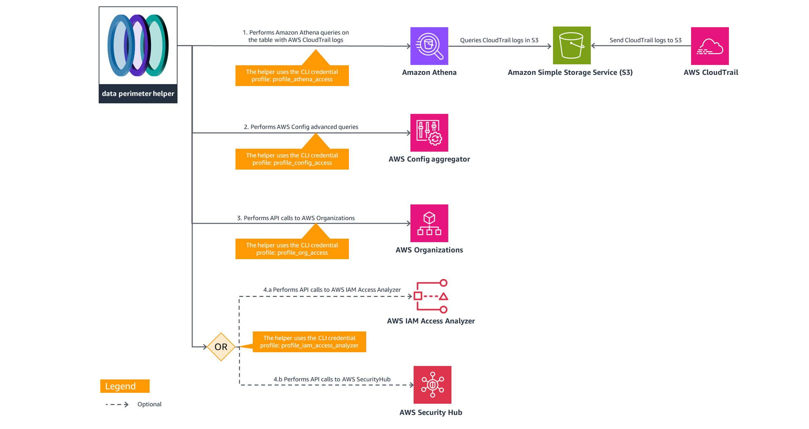

## Overview



## 1. `profile_athena_access` principal permissions sample
```jsonc
{
    "Version": "2012-10-17",
    "Statement": [
        {
            "Sid": "DPHAthenaAccess",
            "Effect": "Allow",
            "Action": [
                "athena:GetWorkGroup",
                "athena:BatchGetQueryExecution",
                "athena:ListQueryExecutions",
                "athena:GetQueryExecution",
                "athena:GetQueryResults",
                "athena:StartQueryExecution"
            ],
            "Resource": [
                "arn:aws:athena:<REGION>:<ACCOUNT_ID>:workgroup/<ATHENA_WORKGROUP_NAME>"
            ]
        },
        {
            "Sid": "DPHGlueAccess",
            "Effect": "Allow",
            "Action": [
                "glue:GetTable",
                "glue:GetDatabases"
            ],
            "Resource": [
                "arn:aws:glue:<REGION>:<ACCOUNT_ID>:catalog",
                "arn:aws:glue:<REGION>:<ACCOUNT_ID>:database/<GLUE_DATABASE_NAME>",
                "arn:aws:glue:<REGION>:<ACCOUNT_ID>:table/<GLUE_DATABASE_NAME>/<ATHENA_TABLE_NAME>"
            ]
        },
        {
            "Sid": "DPHCloudTrailLogsS3",
            "Effect": "Allow",
            "Action": [
                "s3:ListBucket",
                "s3:GetObject"
            ],
            "Resource": [
                "arn:aws:s3:::<CLOUDTRAIL_LOGS_BUCKET_NAME>",
                "arn:aws:s3:::<CLOUDTRAIL_LOGS_BUCKET_NAME>/*"
            ]
        },
        // If CloudTrail logs are encrypted with an AWS KMS Key
        {
            "Sid": "DPHCloudTrailLogsKMS",
            "Effect": "Allow",
            "Action": [
                "kms:Decrypt"
            ],
            "Resource": [
                "<CLOUDTRAIL_LOGS_KEY_ARN>"
            ]
        },
        {
            "Sid": "DPHAthenaOutputsS3",
            "Effect": "Allow",
            "Action": [
                "s3:ListBucket",
                "s3:ListBucketMultipartUploads",
                "s3:ListMultipartUploadParts",
                "s3:GetBucketLocation",
                "s3:GetObject",
                "s3:AbortMultipartUpload",
                "s3:PutObject"
            ],
            "Resource": [
                "arn:aws:s3:::<ATHENA_OUTPUTS_BUCKET_NAME>",
                "arn:aws:s3:::<ATHENA_OUTPUTS_BUCKET_NAME>/*"
            ]
        },
        // If Athena outputs are encrypted with an AWS KMS Key
        {
            "Sid": "DPHAthenaOutputsKMS",
            "Effect": "Allow",
            "Action": [
                "kms:Decrypt",
                "kms:GenerateDataKey"
            ],
            "Resource": [
                "<ATHENA_OUTPUTS_KEY_ARN>"
            ]
        }
    ]
}
```

## 2. `profile_config_access` principal permissions sample
```jsonc
{
    "Version": "2012-10-17",
    "Statement": [
        {
            "Sid": "DPHConfig",
            "Effect": "Allow",
            "Action": [
                "config:SelectAggregateResourceConfig"
            ],
            "Resource": [
                "<CONFIG_AGGREGATOR_ARN>"
            ]
        }
    ]
}
```

## 3. `profile_org_access` principal permissions sample
```jsonc
{
    "Version": "2012-10-17",
    "Statement": [
        {
            "Sid": "DPHOrganization",
            "Effect": "Allow",
            "Action": [
                "organizations:ListAccounts",
                "organizations:ListChildren",
                "organizations:ListRoots"
            ],
            "Resource": [
                "*"
            ]
        }
    ]
}
```

## 4. Principal with profile `profile_iam_access_analyzer` permissions sample
```jsonc
{
    "Version": "2012-10-17",
    "Statement": [
        {
            "Sid": "ListEnabledRegions",
            "Effect": "Allow",
            "Action": [
                "account:ListRegions"
            ],
            "Resource": [
                "arn:aws:account::<MANAGED_ACCOUNT_ID>:account/<ORGANIZATION_ID>/<ACCOUNT_ID>"
            ]
        },
    ]
}
```

You then need to add the following statements if you use as a data source AWS IAM Access Analyzer or AWS Security Hub.

### 4.a If the variable `external_access_findings` is set to `IAM_ACCESS_ANALYZER`
```jsonc
{
    "Version": "2012-10-17",
    "Statement": [
        {
            "Sid": "ListAnalyzers",
            "Effect": "Allow",
            "Action": [
                "access-analyzer:ListAnalyzers"
            ],
            "Resource": [
                "*"
            ]
        },
        {
            "Sid": "GetAAFindings",
            "Effect": "Allow",
            "Action": [
                "access-analyzer:ListFindings",
                "access-analyzer:GetFinding"
            ],
            "Resource": [
                "*"
            ]
        }
    ]
}
```

### 4.b If the variable `external_access_findings` is set to `SECURITY_HUB`
```jsonc
{
    "Version": "2012-10-17",
    "Statement": [
        {
            "Sid": "DPHSecurityHub",
            "Effect": "Allow",
            "Action": [
                "securityhub:GetFindings"
            ],
            "Resource": [
                "*"
            ]
        }
    ]
}
```
